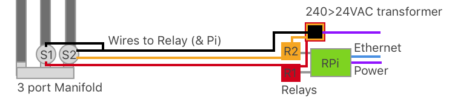

# SRPinkler

## Overview

SRPinkler is an easy to use and setup garden watering automation system by Raspberry Pi, GrovePi+ featuring multi-zone watering support, timers and iOS notifications and easy set up instructions for novice Raspberry Pi users (like me).

Based off the dual-premise that it is better for plants for them to be watered early in the morning and that most people don't like to wake up at 4am to water the garden, this project walks through both the code and IRL setups required to automate your garden watering.

This readme is divided into three parts excluding this overview:

* [Plumbing](#plumbing)
* [Electronics](#electronics)
* [Code](#code)

Depending on your set up you will/may need:

* [Raspberry Pi](https://littlebirdelectronics.com.au/products/raspberry-pi-2-model-b-1)
* [GrovePi+ board](https://www.dexterindustries.com/shop/grovepi-board/)
* [Seeed Studio Grove relay](https://www.seeedstudio.com/Grove-Relay-p-769.html)
* [Some 25mm solenoids](https://www.bunnings.com.au/k-rain-solenoid-valve_p3120237)
* [A 240 > 24V transformer](https://www.jaycar.us/mains-adaptor-24vac-1a-unregulated-bare-ends/p/MP3032) (this is the bit that worries me)
* Some [7 core irrigation wire](https://www.bunnings.com.au/toro-10m-7-core-irrigation-wire_p3110720).
* [Irrigation wire connectors](https://www.bunnings.com.au/holman-wire-cable-irrigation-connectors-10-pack_p3119565)
* Existing watering system (made primarily with [19mm PVC poly pieces](https://www.bunnings.com.au/search/products?q=19mm%20poly))
* [Pope 25mm 3 outlet manifold](https://www.bunnings.com.au/pope-25mm-3-outlet-manifold_p3120691)
* 3 x lengths of rigid BSP pipe (thicker, solid pipe with male threaded ends)
* [Assorted BSP 1" bits and pieces](https://www.bunnings.com.au/search/products?q=bsp%20pipe%201%22) - I would recommend staying away from the "[nut and tail](https://www.bunnings.com.au/pope-25mm-poly-nut-and-tail_p3123863)" type joins as they seem quite hard to get to stop leaking.
* Watering devices to suit your garden (sprinklers, drippers, misters)

I should also point out that I've found lots of great projects online which tackle this problem in similar ways. [Open Sprinkler Pi](https://opensprinkler.com/product/opensprinkler-pi/) really took my fancy, but I realised that because I already had a Pi and Grove, I didn't really need to buy a seperate controller.

**If you're considering this yourself, a word of warning**

This probably won't save you money. It may not even save your garden.

For me, excluding the cost of the Pi and Grove (which I already had) the total cost of this experiment has probably been about $180AUD allowing $150 for plumbing supplies, $30 for additional power boards, ethernet cables etc.  This actually isn't insane given that it will easily cost [about $100](https://www.bunnings.com.au/search/products?facets=CategoryIdPath%3D2a021706-07d5-4648-bf26-2ea8fea049df%20%3E%2001f69b03-7098-42c3-b3c2-0a3c184efb7c%20%3E%20e5264067-f17e-4981-9c75-26549d354caa%20%3E%2042eb706d-7dc4-4acb-af34-f13db5f9c46a%20%3E%201cd2c5bb-f801-4add-bb56-6a7e8e76dce7) to buy a controller at your hardware shop and then you'll have to hand over more for solenoids, pipes, wires etc.

For me, the most important thing I've learnt through this project is the _consequences actions can have when you move from the digital world into the real world_. Most web developers and designers play in a world where the worst that can happen to them personally as a result of a failure in their decisions is that they get less conversions on a transactions, or their site goes offline for a few hours. In this project, making a mistake could cost me my garden (which could die or be drowned) or damage the foundations of my house (if the manifold or pipes burst and spew water out, underneath my house, for days while I'm away from home).

Still, I'd recommend this regardless. It's been great fun. I hope this helps you automate your own garden.

This document is broken into four sections for easy reference, and the code is really simple. I'll try and keep the software concerns seperate as I build this project out over time so you can pick it up and use what you need without needing to understand lots of complicated code. I'll also try and remember to comment lots so it's easy to understand. Thank you to all the other open source projects that do this also! It's only because of the forethought and generosity of time others have given that I've been able to learn how to do any of this.  

## Plumbing

The plumbing setup is quite simple.


Using my existing watering system, essentially my goal was to create an intelligent hub through which the water flowed when I wanted to.

To do this, the mains water goes into the manifold, where it is then stopped by the solenoids. When the solenoid is opened by the relays attached to the RPi, the water flows. By default, the relays are closed and take electric current to keep them open. This works for me because it means that in the event of a power-failure I won't flood my house.

Although I felt quite confident about the plumbing side of things, one of the things I learnt through this process is that it's actually really hard to do plumbing if you care about slow drips. Also important is to consider that this is one of the few projects where you're combining water and electricity - two things that shouldn't really meet unless you're interested in entering the Darwin awards.


My first attempt at building out the manifold used 19mm Poly pipes and joiners to connect things. This didn't work so well and burst just before I proudly demonstrated my new fool-proof internet-powered garden watering system to [Andy Carson](https://github.com/arcarson). The mains water pressure was too much for the plastic clips I used.


To solve this, I decided to replace the entire manifold and feeder system with more study rigid BSP pipes and [steel screw-tightened clips](https://www.bunnings.com.au/kinetic-11-25mm-304-stainless-steel-hose-clamps_p4920192) wherever I moved into poly pipe.


Here you can see all the pieces assembled and in their box in preparation for going into my shed.


Once I put this in, I found that there was then an issue with the "Nut and Tail" joints I'd used at the end of the BSP. They leaked - I even cracked the plastic on one hand-tightening it so it wasn't going to last long. In the picture below you can see the failed unit on the bottom, and the replacement on the top.


 This is because it's difficult to get a tight enough seal as the joint is made in two pieces with a washer. I solved this buy replacing the Nut and tail with a BSP female threaded joint and one piece 19mm reducers.


Once I had this all assembled, I set up a `cron` job to trigger my watering system on and off for a minute at a time in order to pressure test and rock/jerk the system around a bit. Turning water one and off with a solenoid is quite a violent process (you'll hear it - there is quite a bit of pressure involved in mains water) and I think this is what caused my first iteration to fail. Turning it on and off rapidly means you get to i) see if it leaks and ii) hopefully accelerate any failure so you can fix it before you come to rely on it working properly.

## Electronics

From an electronics perspective, it took me a while to figure out what was needed. Thanks to by Grove Pi kit, I had a relay, but just no real idea how to use it. Also no idea how to avoid electrocute myself.

Enter many hours of youtube research and videos.

Through this research I found that I'd need to do the following:



1. Connect the black wire to one of the cables from each solenoid (they have two each) and also to the transformer. This is the "power wire" and provides one half of the circuit needed to turn on the solenoid.
2. The second wire (I chose red and white (shown as yellow) provides the "control" wire.
3. The "control" wire is fed through the relay and then back to the second wire from the transformer. This way, when the relay is activated, the circuit is completed and the solenoid is able to activate (allowing water to flow).

Because water is being used in close proximity to electricity here, I wouldn't recommend doing this unless you felt pretty confident in your knowledge. There are a few things I did to keep myself safe.

1. _Most importantly:_ I did not plug in the transformer until I was sure there were no exposed wires
2. I made sure that I put electrical tape over the ends of any exposed wires before I plugged anything in.
3. The transformer I used for this project takes the 240VAC (240 Volts Alternating Current) found in an Australian powerpoint and drops it down to 24VAC. This is a much lower voltage (garden lights use 12VAC so that you don't die if you cut through a wire), but I'd prefer to be safer than sorry. Supposedly a 24V current can kill you if it gets under your skin.
4. I put the solenoids (which were the piece most likely to come into direct contact with water) were inside a plastic tub. This way, if the solenoid failed or there was a leak, water wouldn't spay all over my shed, and would just dribble over the floor (turned out this safety feature was used :-) ).
5. I ended up using these nifty [little waterproof wire connectors](https://www.bunnings.com.au/holman-wire-cable-irrigation-connectors-10-pack_p3119565). They are one used only, but flood themselves with a gel when used to create a water proof seal on the wires. This is important as although the solenoids _shouldn't_ get wet when they're being used, as I found when I flooded mine, they can sometimes.

With all this in mind, I ended up with a situation like this.


Here you can see:

1. Raspberry Pi and Grove Pi board on left inside green box.
2. Input compartment bottom right for 7 core irrigation wire.
3. First relay connected in it's own compartment (white wires)
4. Wires taped waiting for second relay to arrive from [Little Bird Electronics](https://littlebirdelectronics.com.au).
5.  Temperature/humidity sensor top right (for a [seperate project](http://tagell.com/projects/kyneton-temperature-logger/))
6.  Holes for ethernet and USB-power to come into the green box to power and control the Raspberry Pi.


## Code

### Installation

To get sRPinkler working you'll need to do the following on your Pi.

1. Download the Dexter Industries image from their github repository and get this onto your MicroSD card.
2. Follow the steps to set the GrovePi+ including upgrading the firmware. This is important as I've had issues with the GrovePi+ needing a hard reset without this. You'll notice this if you see the red RST light illuminated or if the water just doesn't run.
3. Clone the rep into your Projects directory. I store all my projects at `~/Projects/` and the sPinkler at `~/Projects/garden-watering-project`. Note: This is important as you'll need absolute paths in both `Crontab` and your `scheduler.rb` file.
4. Install `RVM` [following these instructions](https://rvm.io/rvm/install). Note: I could not get this system to work using `rbenv` as it does not have the `crontab` integration mentioned below.
5. then `rvm install 2.3.0`
6. Create a gemset called `garden` buy running `rvm gemset create garden`.
7. Run `gem install bundler` followed by `bundle install` to install the required gems into the gemset you've created.
8. Run `rvm cron setup` to enable your crontab to access the version of ruby and gemset you've created. Thanks [Daniel Schmidt](https://coderwall.com/p/vhv8aw/getting-ruby-scripts-working-with-bundler-rvm-and-cron)

### Configuring your electronics and zones
1. Once you've got your Ruby environment set up, it's time to configure your Grove Relays to trigger at the right times. To do this, open the file `scheduler.rb`.
2. At the top of the files are the variables you need to configure. To make the relays work you'll need to make sure that the relay number specified for each zone matches the digital port you've plugged into on your GrovePi+. For simplicity I use 5, 4 and 3 as this has them sitting next to each other (Hello OCD...nice to see you here):
```
@zone_1_relay = 5
@zone_2_relay = 4
@zone_3_relay = 3
```
3. This is also where you can customise the names of your zones by modifying the entries for `@zone_n_friendly_name`. Make sure your friendly name is surrounded by the `"` character.
4. For reporting purposes, you can also set up a flow rate here by modifying the `@zone_n_flow_rate` entries. This number is in **litres per minute**. The easiest way to get this is to make sure no other water is being used in your house and do a test water of the zone you're looking to get the flow rate for. I recommend using your smartphone to take a video for around 30 seconds while you wait for at least a litre of water to flow through the meter. Depending on your watering system this will take a long time (drippers) or a short time (sprinklers). To calculate `flow_rate`:
* look at how many seconds it took to use a litre of water.
* Divide by the number of seconds it took and multiply by 60. eg. if it takes 43 seconds to use a litre of water.
`1 / 43 * 60 = 1.39 litres per minute`

### Notifications

In order to get Notifications working, you'll need to set up a [Pushover Account](#) then decide which devices you want to notify when a watering system is completed. At present notifications include the duration of watering in minutes and the volume of water used. Volume of water used is an approximation.

To setup notifications:

1. Go to `Pushover` and signup for an account.
2. Obtain your `PUSHOVER USER KEY`
3. Create a new application and get it's `PUSHOVER APP TOKEN`.
4. Rename the file called `.env.sample` in the root of your directory (eg. for me `~/Projects/garden-watering-project/.env`) and add these two entries to the file in format you find there:

example .env file
```
PUSHOVER_APP_TOKEN=apptokengoeshere
PUSHOVER_USER_KEY=userkeygoeshere
```
5. Install the Pushover app on the devices you'd like the notified on (eg. the Pusover iOS application) and sign in using your account credentials.


#### Test notifications
Test notifications by opening your terminal and running:

`cd /home/pi/Projects/garden && /home/pi/.rvm/wrappers/ruby-2.3.0@garden/ruby /home/pi/Projects/garden/scheduler.rb 2 >> /tmp/cron_output`

Note: this will turn on your garden watering for 2 seconds, then submit a notification to pushover. If it doesn't work, there is probably an error either in your `.env` file or your pushover implementation. The other issue I have run into many times is that the environment in which `cron` runs does not have access to your gems (and hence can't get to the `.env` file using the `dotenv` gem). The only way I found to resolve this was to follow the RVM related steps above.

### Test watering

I would strongly recommend doing a test watering once you've got to this point. I'd also suggest testing in a way that will pump the pipes quite hard to make sure that, if something is going to break, it breaks while you're testing it and not once you go on holidays for a week (and flood your house).

The test watering script below will stress test your watering system by turning it on ever minute for 30 seconds (enough time to hopefully fill your pipes and get to max pressure (the sort that causes your plumbing to pop apart), 30 seconds break then turn it on again). If you have more than one zone, each zone will run sequentially.

To test water in this way, open terminal, type `crontab -e` and paste in the following script.

If you have one zone (runs every minute)
```
* * * * * cd /home/pi/Projects/garden && /home/pi/.rvm/wrappers/ruby-2.3.0@garden/ruby /home/pi/Projects/garden/scheduler.rb 30 >> /tmp/cron_output
```

If you have two zone (runs every second minute)
```
*/2 * * * * cd /home/pi/Projects/garden && /home/pi/.rvm/wrappers/ruby-2.3.0@garden/ruby /home/pi/Projects/garden/scheduler.rb 30 30 >> /tmp/cron_output
```

Let the script run for 10-20 minutes. Press `CTRL+C` to kill the script (make sure you're in a break period when you do this or you'll need to hard reset)


### Setting up ongoing automatic watering.
1. From terminal, type `crontab -e` to edit your crontab file (`crontab` runs tasks every minute on a schedule you specify).
2. Read through the example crontabs below. Pick one, modify it to suit your needs, then paste the following into the `crontab`. Make sure there is a new line at the end of it. These lines should go immediately after the lines added by `RVM`.

eg. Running one zone, twice a day starting at 5:01am for 1200 seconds and starting at 6:01pm for 800 seconds
```
01 5 * * * cd /home/pi/Projects/garden && /home/pi/.rvm/wrappers/ruby-2.3.0@garden/ruby /home/pi/Projects/garden/scheduler.rb 1200 >> /tmp/cron_output
01 18 * * * cd /home/pi/Projects/garden && /home/pi/.rvm/wrappers/ruby-2.3.0@garden/ruby /home/pi/Projects/garden/scheduler.rb 800 >> /tmp/cron_output
```
eg. Running two zones, twice a day starting at 5:01am for 1200 seconds each (one after the other) and starting at 6:01pm for 800 seconds each (one after the other)
```
01 5 * * * cd /home/pi/Projects/garden && /home/pi/.rvm/wrappers/ruby-2.3.0@garden/ruby /home/pi/Projects/garden/scheduler.rb 1200 1200 >> /tmp/cron_output
01 18 * * * cd /home/pi/Projects/garden && /home/pi/.rvm/wrappers/ruby-2.3.0@garden/ruby /home/pi/Projects/garden/scheduler.rb 800 800 >> /tmp/cron_output
```
eg. Running two zones, twice a day starting at 5:01am with the first zone running for 1200 seconds and the second for 500 seconds (one after the other) and starting at 6:01pm with only the second zone being watered for 800 seconds each (one after the other)
```
01 5 * * * cd /home/pi/Projects/garden && /home/pi/.rvm/wrappers/ruby-2.3.0@garden/ruby /home/pi/Projects/garden/scheduler.rb 1200 500 >> /tmp/cron_output
01 18 * * * cd /home/pi/Projects/garden && /home/pi/.rvm/wrappers/ruby-2.3.0@garden/ruby /home/pi/Projects/garden/scheduler.rb 0 800 >> /tmp/cron_output
```
eg. Running three zones, one after the other starting at 5:01am. Zone one first for 1200 seconds, zone two for 500 seconds and zone three for 600 seconds.
```
01 5 * * * cd /home/pi/Projects/garden && /home/pi/.rvm/wrappers/ruby-2.3.0@garden/ruby /home/pi/Projects/garden/scheduler.rb 1200 500 600 >> /tmp/cron_output
```
